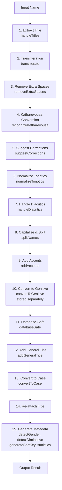

# GreekNameCorrection

A powerful, zero-dependency library for correcting, formatting, and validating Greek names with advanced features including transliteration, genitive conversion, and intelligent name processing. Works seamlessly in both Node.js and browser environments.


## Features

✨ **Zero Dependencies** - Lightweight and fast  
🇬🇷 **Greek-Specific** - Built for Greek name conventions  
🔄 **Transliteration** - Greeklish ↔ Greek ↔ Latin  
📝 **Smart Formatting** - Proper capitalization and syntax  
👔 **Title Support** - Handles Greek honorifics (Δρ., Καθ., etc.)  
🎩 **Auto Title Addition** - Automatically adds general titles (Κ. for men, Κα for women)  
🔀 **Case Conversion** - Genitive, vocative, and accusative forms  
🎯 **Gender Detection** - Identifies gender from name endings  
📊 **Statistics** - Comprehensive name analysis  
🔍 **Diminutive Detection** - Recognizes nickname patterns  
🏛️ **Katharevousa Support** - Converts archaic forms  
💾 **Database-Safe** - SQL-ready output  
🔤 **Sort Keys** - Accent-free sorting support  
✅ **Validation** - Greek name pattern validation  
🔧 **Flexible I/O** - Supports strings, arrays, and objects  
✨ **Accent Addition** - Automatically adds accents to unaccented Greek names using comprehensive name dictionary (1,100+ names) with intelligent fallback rules

## Installation
```bash
npm install greek-name-correction
```

## Quick Start
```javascript
const GreekNameCorrection = require('greek-name-correction');

// Simple correction
const name = GreekNameCorrection('γιώργος παπαδόπουλος');
console.log(name); // "Γιώργος Παπαδόπουλος"

// With options
const result = GreekNameCorrection('δρ. μαρια κωνσταντινου', {
  preserveOriginal: true,
  detectGender: true,
  convertToGenitive: true
});
console.log(result);
// {
//   corrected: "Δρ. Μαρία Κωνσταντίνου",
//   original: "δρ. μαρια κωνσταντινου",
//   isValid: true,
//   title: "Δρ.",
//   gender: "female",
//   genitive: "Δρ. Μαρία Κωνσταντίνου",
//   parts: { firstName: "Μαρία", lastName: "Κωνσταντίνου" }
// }
```

## Command-Line Interface (CLI)

The library includes a CLI tool for use from the command line.

### Installation

To use the CLI globally:
```bash
npm install -g greek-name-correction
```

Or use it directly with `npx`:
```bash
npx greek-name-correction -name "NAME" [OPTIONS]
```

### Usage

```bash
# Basic usage
greek-name-correction -name "γιώργος παπαδόπουλος"
# → "Γιώργος Παπαδόπουλος"

# Positional argument (name without -name flag)
greek-name-correction "Ραυτόπουλος Σταύρος" -convertToCase vocative
# → "Ραυτόπουλε Σταύρο"

# With options
greek-name-correction -name "Γιώργος Παπαδόπουλος" -convertToCase vocative
# → "Γιώργο Παπαδόπουλο"

# JSON output with preserveOriginal
greek-name-correction -name "Μαρία Κωνσταντίνου" -detectGender -addGeneralTitle -preserveOriginal -json
# → JSON object with all details
```

### Available Options

| Option | Description |
|--------|-------------|
| `-name, --name <name>` | Name to correct (required if not provided as positional argument) |
| `-convertToCase <case>` | Convert to case: `vocative` or `accusative` |
| `-transliterate <type>` | Transliteration: `greeklish-to-greek`, `greek-to-latin`, `greek-to-greeklish` |
| `-convertToGenitive` | Convert to genitive case |
| `-preserveOriginal` | Return object with original and corrected name |
| `-detectGender` | Detect gender from name |
| `-detectDiminutive` | Detect diminutive forms |
| `-suggestCorrections` | Suggest corrections for common misspellings |
| `-recognizeKatharevousa` | Recognize and convert Katharevousa forms |
| `-databaseSafe` | Make output database-safe |
| `-generateSortKey` | Generate sort key (accent-free) |
| `-statistics` | Generate name statistics |
| `-addGeneralTitle` | Add general title (κ./κα) based on gender |
| `-addAccents` | Add accents to firstname and lastname (one accent per word) |
| `-handleTitles` | Handle titles (default: true) |
| `-handleParticles` | Handle Greek particles (default: true) |
| `-strictMode` | Enable strict mode |
| `-json` | Output result as JSON |
| `-help, -h` | Show help message |
| `-version, -v` | Show version |

### Examples

```bash
# Vocative case conversion
greek-name-correction -name "Γιώργος Παπαδόπουλος" -convertToCase vocative

# Accusative case conversion
greek-name-correction -name "Δημήτρης Νικολάου" -convertToCase accusative

# Transliteration
greek-name-correction -name "giorgos papadopoulos" -transliterate greeklish-to-greek

# Multiple options with JSON output
greek-name-correction -name "Μαρία Κωνσταντίνου" -detectGender -addGeneralTitle -preserveOriginal -json

# Add accents to unaccented names
greek-name-correction -name "γιωργος παπαδοπουλος" -addAccents
# → "Γιώργος Παπαδόπουλος"

# Get help
greek-name-correction -help
```

**Note for Windows/PowerShell users:** If you encounter issues with Greek characters in quotes, try:
- Using single quotes: `greek-name-correction -name 'Γιώργος Παπαδόπουλος'`
- Or use a file input: `echo "Γιώργος Παπαδόπουλος" | greek-name-correction`

## Usage Examples

### Basic String Correction
```javascript
// Correct capitalization and spacing
GreekNameCorrection('γιώργος  παπαδόπουλος');
// → "Γιώργος Παπαδόπουλος"

GreekNameCorrection('ΜΑΡΙΑ ΚΩΝΣΤΑΝΤΙΝΟΥ');
// → "Μαρία Κωνσταντίνου"
```

### Array Processing
```javascript
const names = [
  'νίκος αλεξίου',
  'ΕΛΕΝΗ ΓΕΩΡΓΙΟΥ',
  'δημήτρης του παπά'
];

GreekNameCorrection(names);
// → ["Νίκος Αλεξίου", "Ελένη Γεωργίου", "Δημήτρης του Παπά"]
```

### JSON Object Processing
```javascript
const person = {
  id: 1,
  fullname: 'κώστας παπαδάκης',
  age: 30
};

GreekNameCorrection(person, { 
  jsonKey: 'fullname',
  outputKey: 'correctedName'
});
// → { id: 1, fullname: 'κώστας παπαδάκης', age: 30, correctedName: 'Κώστας Παπαδάκης' }
```

### Transliteration
```javascript
// Greeklish to Greek
GreekNameCorrection('giorgos papadopoulos', {
  transliterate: 'greeklish-to-greek'
});
// → "Γιοργος Παπαδοπουλος"

// Greek to Latin
GreekNameCorrection('Γιώργος Παπαδόπουλος', {
  transliterate: 'greek-to-latin'
});
// → "Giorgos Papadopoulos"

// Greek to Greeklish
GreekNameCorrection('Γιώργος Παπαδόπουλος', {
  transliterate: 'greek-to-greeklish'
});
// → "Giorgos Papadopoulos"
```

### Genitive Case Conversion
```javascript
GreekNameCorrection('Γιώργος Παπαδόπουλος', {
  preserveOriginal: true,
  convertToGenitive: true
});
// → { 
//     corrected: "Γιώργος Παπαδόπουλος",
//     genitive: "Γιώργου Παπαδόπουλου"
//   }
```

### Vocative Case Conversion
```javascript
// Convert to vocative case (for addressing someone)
GreekNameCorrection('Γιώργος Παπαδόπουλος', {
  convertToCase: 'vocative'
});
// → "Γιώργο Παπαδόπουλο"

// With preserveOriginal to get both forms
GreekNameCorrection('Γιάννης Αλεξίου', {
  convertToCase: 'vocative',
  preserveOriginal: true
});
// → {
//     corrected: "Γιάννης Αλεξίου",
//     vocative: "Γιάννη Αλεξίου"
//   }

// Feminine names usually remain unchanged
GreekNameCorrection('Μαρία Κωνσταντίνου', {
  convertToCase: 'vocative'
});
// → "Μαρία Κωνσταντίνου"
```

### Accusative Case Conversion
```javascript
// Convert to accusative case (for direct objects)
GreekNameCorrection('Γιώργος Παπαδόπουλος', {
  convertToCase: 'accusative'
});
// → "Γιώργο Παπαδόπουλο"

// With preserveOriginal to get both forms
GreekNameCorrection('Κώστας Παπαδάκης', {
  convertToCase: 'accusative',
  preserveOriginal: true
});
// → {
//     corrected: "Κώστας Παπαδάκης",
//     accusative: "Κώστα Παπαδάκη"
//   }

// Feminine names usually remain unchanged
GreekNameCorrection('Μαρία Κωνσταντίνου', {
  convertToCase: 'accusative'
});
// → "Μαρία Κωνσταντίνου"
```

### Title Handling
```javascript
GreekNameCorrection('δρ. γιώργος παπαδόπουλος', {
  preserveOriginal: true,
  handleTitles: true
});
// → { 
//     corrected: "Δρ. Γιώργος Παπαδόπουλος",
//     title: "Δρ."
//   }
```

### Automatic General Title Addition
```javascript
// Add general title (κ. for men, κα for women) if no title exists
// Titles are always lowercase
GreekNameCorrection('Γιώργος Παπαδόπουλος', {
  addGeneralTitle: true
});
// → "κ. Γιώργος Παπαδόπουλος"

GreekNameCorrection('Μαρία Κωνσταντίνου', {
  addGeneralTitle: true
});
// → "κα Μαρία Κωνσταντίνου"

// Names with existing titles are not modified
GreekNameCorrection('Δρ. Γιώργος Παπαδόπουλος', {
  addGeneralTitle: true
});
// → "Δρ. Γιώργος Παπαδόπουλος"

// Works with preserveOriginal option
GreekNameCorrection('Ελένη Γεωργίου', {
  addGeneralTitle: true,
  preserveOriginal: true
});
// → {
//     corrected: "κα Ελένη Γεωργίου",
//     original: "Ελένη Γεωργίου",
//     title: "κα",
//     isValid: true
//   }
```

### Accent Addition
```javascript
// Add accents to unaccented Greek names (one accent per word)
// Uses comprehensive name dictionary for accurate placement
GreekNameCorrection('γιωργος παπαδοπουλος', {
  addAccents: true
});
// → "Γιώργος Παπαδόπουλος"

GreekNameCorrection('μαρια κωνσταντινου', {
  addAccents: true
});
// → "Μαρία Κωνσταντίνου"

// Words that already have accents are preserved
GreekNameCorrection('Γιώργος Παπαδόπουλος', {
  addAccents: true
});
// → "Γιώργος Παπαδόπουλος" (unchanged)

// Works with preserveOriginal option
GreekNameCorrection('νικος αλεξιου', {
  addAccents: true,
  preserveOriginal: true
});
// → {
//     corrected: "Νίκος Αλεξίου",
//     original: "νικος αλεξιου",
//     isValid: true
//   }

// Each word gets exactly one accent
GreekNameCorrection('δημήτρης νικολάου', {
  addAccents: true
});
// → "Δημήτρης Νικολάου"

// Uses name dictionary for accurate accent placement
// Falls back to heuristic rules for unknown names
GreekNameCorrection('γιαννης γεωργιου', {
  addAccents: true
});
// → "Γιάννης Γεωργίου"
```

**Note**: The `addAccents` feature (v2.2.1+) uses a comprehensive name dictionary built from `generate_greek_names.js` with over 1,100 Greek names. It first checks the dictionary for accurate accent placement, then falls back to intelligent heuristic rules based on word endings for names not in the dictionary.

### Name Corrections
```javascript
GreekNameCorrection('γιοργος παπαδοπουλος', {
  preserveOriginal: true,
  suggestCorrections: true
});
// → {
//     corrected: "Γιώργος Παπαδόπουλος",
//     wasCorrected: true,
//     suggestedCorrection: "γιώργος παπαδόπουλος"
//   }
```

### Diminutive Detection
```javascript
GreekNameCorrection('Γιωργάκης Παπαδάκης', {
  preserveOriginal: true,
  detectDiminutive: true
});
// → {
//     corrected: "Γιωργάκης Παπαδάκης",
//     diminutive: [
//       { word: "Γιωργάκης", isDiminutive: true, possibleBase: "γιωργας/ης", diminutiveType: "άκης" },
//       { word: "Παπαδάκης", isDiminutive: true, possibleBase: "παπαδας/ης", diminutiveType: "άκης" }
//     ]
//   }
```

### Gender Detection
```javascript
GreekNameCorrection('Γιάννης Παπαδόπουλος', { 
  preserveOriginal: true,
  detectGender: true 
});
// → { corrected: "Γιάννης Παπαδόπουλος", gender: "male" }

GreekNameCorrection('Μαρία Παπαδοπούλου', { 
  preserveOriginal: true,
  detectGender: true 
});
// → { corrected: "Μαρία Παπαδοπούλου", gender: "female" }
```

### Database-Safe Output
```javascript
GreekNameCorrection('Γιώργος@# Παπα!δόπουλος', {
  databaseSafe: true
});
// → "Γιώργος Παπαδόπουλος"
```

### Sort Key Generation
```javascript
GreekNameCorrection('Άννα Παπαδοπούλου', {
  preserveOriginal: true,
  generateSortKey: true
});
// → {
//     corrected: "Άννα Παπαδοπούλου",
//     sortKey: "αννα παπαδοπουλου"
//   }
```

### Name Statistics
```javascript
GreekNameCorrection('Δρ. Γιώργος της Μαρίας Παπαδόπουλος', {
  preserveOriginal: true,
  statistics: true,
  handleTitles: true,
  handleParticles: true
});
// → {
//     corrected: "Δρ. Γιώργος της Μαρίας Παπαδόπουλος",
//     statistics: {
//       length: 41,
//       originalLength: 41,
//       wordCount: 3,
//       hasParticles: true,
//       hasAccents: true,
//       hasDiaeresis: false,
//       isAllCaps: false,
//       isAllLower: false,
//       hasNumbers: false,
//       hasSpecialChars: false
//     }
//   }
```

## API Reference

### Main Function
```javascript
GreekNameCorrection(input, options)
```

#### Parameters

- **input** `{string|string[]|Object|Object[]}` - Name(s) to process
  - `string`: Single name
  - `string[]`: Array of names
  - `Object`: Single object with name property
  - `Object[]`: Array of objects with name property

- **options** `{Object}` - Configuration options (all optional)

#### Options

| Option | Type | Default | Description |
|--------|------|---------|-------------|
| `jsonKey` | `string` | `'fullname'` | Property name for input names in objects |
| `outputKey` | `string` | `'correctedFullname'` | Property name for corrected names in objects |
| `preserveOriginal` | `boolean` | `false` | Return detailed object instead of string |
| `splitNames` | `boolean` | `true` | Split and process name parts separately |
| `detectGender` | `boolean` | `false` | Detect gender from name endings |
| `normalizeTonotics` | `boolean` | `true` | Normalize Greek accent marks |
| `handleDiacritics` | `boolean` | `true` | Properly handle Greek diacritics |
| `strictMode` | `boolean` | `false` | Strict Greek character validation |
| `removeExtraSpaces` | `boolean` | `true` | Remove extra whitespace |
| `handleParticles` | `boolean` | `true` | Handle Greek particles (του/της/των) |
| `convertToGenitive` | `boolean` | `false` | Convert to genitive case |
| `convertToCase` | `string\|null` | `null` | Convert to case: `'vocative'` or `'accusative'` |
| `transliterate` | `string\|null` | `null` | Transliteration mode: `'greeklish-to-greek'`, `'greek-to-latin'`, `'greek-to-greeklish'` |
| `detectDiminutive` | `boolean` | `false` | Detect diminutive/nickname forms |
| `handleTitles` | `boolean` | `true` | Extract and format titles |
| `addGeneralTitle` | `boolean` | `false` | Automatically add general title (κ. for men, κα for women) if no title exists (always lowercase) |
| `addAccents` | `boolean` | `false` | Add accents to firstname and lastname (one accent per word). Uses comprehensive name dictionary (1,100+ names) for accurate placement, with intelligent fallback rules |
| `suggestCorrections` | `boolean` | `false` | Suggest corrections for misspellings |
| `recognizeKatharevousa` | `boolean` | `false` | Convert archaic Greek forms |
| `databaseSafe` | `boolean` | `false` | Remove problematic characters |
| `generateSortKey` | `boolean` | `false` | Generate accent-free sort key |
| `statistics` | `boolean` | `false` | Generate name statistics |

#### Return Value

Returns the same type as input:
- `string` → `string` (or `Object` if `preserveOriginal: true`)
- `string[]` → `string[]` (or `Object[]` if `preserveOriginal: true`)
- `Object` → `Object` (with added corrected name property)
- `Object[]` → `Object[]` (with added corrected name properties)

When `preserveOriginal: true`, returns an object with:
```javascript
{
  corrected: string,        // Corrected name
  original: string,         // Original input
  isValid: boolean,         // Validation result
  title?: string,           // Extracted title (if handleTitles)
  gender?: string,          // Detected gender (if detectGender)
  parts?: Object,           // Name parts (if splitNames)
  diminutive?: Array,       // Diminutive info (if detectDiminutive)
  genitive?: string,        // Genitive form (if convertToGenitive)
  vocative?: string,        // Vocative form (if convertToCase: 'vocative')
  accusative?: string,      // Accusative form (if convertToCase: 'accusative')
  sortKey?: string,         // Sort key (if generateSortKey)
  statistics?: Object,      // Name statistics (if statistics)
  wasCorrected?: boolean,   // If corrections were applied
  suggestedCorrection?: string  // Suggested correction
}
```

## Supported Greek Titles

The library recognizes and properly formats the following Greek titles:

- **General**: Κος, Κα, Δις, Κυρ, Κυρία, Κύριος, Δεσποινίς
- **Academic**: Δρ, Καθ, Καθηγητής, Καθηγήτρια
- **Political**: Πρωθυπουργός, Υπουργός, Βουλευτής, Δήμαρχος, Περιφερειάρχης
- **Religious**: Αρχιεπίσκοπος, Μητροπολίτης, Επίσκοπος, Πατήρ
- **Military**: Στρατηγός, Ταξίαρχος, Συνταγματάρχης, Αντισυνταγματάρχης

### Automatic General Title Addition

When `addGeneralTitle: true` is enabled, the library automatically adds general titles based on detected gender:
- **κ.** (κύριος) for male names
- **κα** (κυρία) for female names

**Note:** General titles are always added in lowercase format. This feature only adds titles when no existing title is detected, ensuring that professional or academic titles are preserved.

## Common Name Corrections

The library automatically corrects common Greek name misspellings:

| Misspelling | Correction |
|-------------|------------|
| γιοργος | γιώργος |
| δημητρης | δημήτρης |
| νικος | νίκος |
| μαρια | μαρία |
| ελενη | ελένη |
| κωνσταντινος | κωνσταντίνος |
| ιωαννης | ιωάννης |
| And many more... | |

## Transliteration Tables

### Greeklish to Greek

The library uses intelligent multi-character pattern matching:

- `th` → `θ`
- `ch` → `χ`
- `ps` → `ψ`
- `ou` → `ου`
- `ai` → `αι`
- `ei` → `ει`
- `mp` → `μπ`
- `nt` → `ντ`
- `gk` → `γκ`
- And all single characters...

### Greek to Latin/Greeklish

Full support for all Greek characters including accented vowels and diaeresis.

## Advanced Usage

### Complete Name Processing Pipeline
```javascript
const result = GreekNameCorrection('dr giorgos tou papa', {
  transliterate: 'greeklish-to-greek',
  preserveOriginal: true,
  handleTitles: true,
  addGeneralTitle: true,
  addAccents: true,
  handleParticles: true,
  suggestCorrections: true,
  detectGender: true,
  convertToGenitive: true,
  generateSortKey: true,
  statistics: true,
  detectDiminutive: true,
  databaseSafe: true
});

console.log(result);
// Complete analysis with all features enabled
```

### Batch Processing with Custom Keys
```javascript
const employees = [
  { empId: 1, employeeName: 'giorgos papadopoulos', dept: 'IT' },
  { empId: 2, employeeName: 'maria konstantinou', dept: 'HR' }
];

const processed = GreekNameCorrection(employees, {
  jsonKey: 'employeeName',
  outputKey: 'greekName',
  transliterate: 'greeklish-to-greek',
  detectGender: true,
  preserveOriginal: true
});
```

### Database Integration Example
```javascript
// For SQL Server / PostgreSQL
const safeName = GreekNameCorrection(userInput, {
  databaseSafe: true,
  removeExtraSpaces: true,
  strictMode: true
});

// For sorting queries
const { corrected, sortKey } = GreekNameCorrection(name, {
  preserveOriginal: true,
  generateSortKey: true
});

// INSERT INTO users (name, name_sort) VALUES (?, ?)
// [corrected, sortKey]
```

## Option Interactions and Processing Order

When using multiple options together, it's important to understand the processing order and how options interact with each other. This section explains the execution pipeline, option conflicts, and best practices.

### Processing Order

The library processes names in a specific order to ensure correct results. Here's the exact sequence:



#### Detailed Processing Steps

1. **Title Extraction** (`handleTitles: true` by default)
   - Extracts titles like "Δρ.", "Καθ.", "Κ." from the beginning of the name
   - Title is stored separately and removed from processing

2. **Transliteration** (`transliterate`)
   - Converts between Greek, Greeklish, and Latin scripts
   - Applied early to ensure subsequent steps work on the correct script

3. **Space Normalization** (`removeExtraSpaces: true` by default)
   - Removes extra whitespace and trims the name

4. **Katharevousa Recognition** (`recognizeKatharevousa`)
   - Converts archaic Greek forms to modern Greek

5. **Suggestion Corrections** (`suggestCorrections`)
   - Suggests corrections for common misspellings
   - Applied before normalization to fix errors early

6. **Tonotic Normalization** (`normalizeTonotics: true` by default)
   - Normalizes Greek accent marks to standard forms

7. **Diacritic Handling** (`handleDiacritics: true` by default)
   - Properly handles Greek diacritics (diaeresis, etc.)

8. **Capitalization & Splitting** (`splitNames: true` by default)
   - Splits name into parts and capitalizes each part
   - Handles particles (του/της/των) if `handleParticles: true`

9. **Accent Addition** (`addAccents`)
   - Adds accents to unaccented Greek names
   - Uses comprehensive name dictionary with fallback rules

10. **Genitive Conversion** (`convertToGenitive`)
    - Converts to genitive case
    - **Stored separately** in result object, doesn't modify main processed name

11. **Database-Safe Conversion** (`databaseSafe`)
    - Removes problematic characters for database storage

12. **General Title Addition** (`addGeneralTitle`)
    - Adds "Κ." (for men) or "Κα" (for women) if no title exists
    - Only adds if no title was extracted in step 1

13. **Case Conversion** (`convertToCase: 'vocative' | 'accusative'`)
    - Converts to vocative or accusative case
    - **Stored separately** in result object
    - If `preserveOriginal: false`, returns case form directly

14. **Title Re-attachment**
    - Re-attaches extracted or added title to the processed name

15. **Metadata Generation**
    - `detectGender`: Detects gender from name endings
    - `detectDiminutive`: Detects diminutive forms
    - `generateSortKey`: Generates accent-free sort key
    - `statistics`: Generates comprehensive name statistics

### Option Conflicts and Incompatibilities

Some options don't work well together or have special behaviors:

#### Conflicting Combinations

| Combination | Issue | Solution |
|------------|-------|----------|
| `transliterate: 'greek-to-latin'` + `addAccents` | Accents can't be added to Latin text | Use `addAccents` only with Greek text |
| `transliterate: 'greek-to-latin'` + `convertToCase` | Case conversion only works on Greek text | Case conversion requires Greek input |
| `transliterate: 'greek-to-greeklish'` + `convertToCase` | Case conversion only works on Greek text | Case conversion requires Greek input |
| `databaseSafe: true` + `addAccents` | Database-safe may remove characters needed for accents | Apply `addAccents` before `databaseSafe` (automatic) |
| `convertToCase` + `preserveOriginal: false` | Returns case form string, not main corrected name | Use `preserveOriginal: true` to get both forms |

#### Special Behaviors

**Case Conversion Return Value**
- When `convertToCase` is set and `preserveOriginal: false`, the function returns the case form string directly (not the nominative form)
- When `preserveOriginal: true`, both the corrected nominative and case forms are included in the result object

```javascript
// Returns case form directly
GreekNameCorrection('Γιώργος Παπαδόπουλος', {
  convertToCase: 'vocative'
});
// → "Γιώργο Παπαδόπουλο"

// Returns object with both forms
GreekNameCorrection('Γιώργος Παπαδόπουλος', {
  convertToCase: 'vocative',
  preserveOriginal: true
});
// → {
//     corrected: "Γιώργος Παπαδόπουλος",
//     vocative: "Γιώργο Παπαδόπουλο",
//     ...
//   }
```

**Genitive and Case Conversion Together**
- Both `convertToGenitive` and `convertToCase` can be used together
- Genitive form is stored in `result.genitive`
- Case form is stored in `result.vocative` or `result.accusative`
- The main `corrected` field contains the nominative form

**General Title Addition**
- `addGeneralTitle` only adds a title if no title was extracted in step 1
- If a title already exists, it won't add another one

**Accent Addition Limitations**
- `addAccents` works best on Greek text
- May not work correctly after transliteration to non-Greek scripts
- Uses dictionary lookup first, then falls back to heuristic rules

### Best Practices

#### Recommended Combinations

**Basic Name Correction**
```javascript
GreekNameCorrection('γιώργος παπαδόπουλος', {
  addAccents: true,
  normalizeTonotics: true,
  handleDiacritics: true
});
// Safe and effective for most use cases
```

**Full Name Processing with Metadata**
```javascript
GreekNameCorrection('γιώργος παπαδόπουλος', {
  preserveOriginal: true,
  addAccents: true,
  detectGender: true,
  convertToGenitive: true,
  generateSortKey: true
});
// Gets all information without conflicts
```

**Case Conversion with Full Details**
```javascript
GreekNameCorrection('Γιώργος Παπαδόπουλος', {
  preserveOriginal: true,
  convertToCase: 'vocative',
  convertToGenitive: true,
  detectGender: true
});
// Returns object with nominative, vocative, and genitive forms
```

**Transliteration Workflow**
```javascript
// Step 1: Convert Greeklish to Greek
const greek = GreekNameCorrection('giorgos papadopoulos', {
  transliterate: 'greeklish-to-greek',
  addAccents: true
});

// Step 2: Process the Greek name
const processed = GreekNameCorrection(greek, {
  convertToCase: 'vocative',
  detectGender: true
});
// Separate transliteration from case conversion
```

#### Problematic Combinations to Avoid

**Don't combine transliteration to non-Greek with case conversion:**
```javascript
// ❌ Won't work - case conversion needs Greek text
GreekNameCorrection('Γιώργος Παπαδόπουλος', {
  transliterate: 'greek-to-latin',
  convertToCase: 'vocative'
});
```

**Don't use addAccents after transliteration to non-Greek:**
```javascript
// ❌ Won't work - accents can't be added to Latin
GreekNameCorrection('Γιώργος Παπαδόπουλος', {
  transliterate: 'greek-to-latin',
  addAccents: true
});
```

**Do use preserveOriginal when you need multiple forms:**
```javascript
// ✅ Correct - gets all forms
GreekNameCorrection('Γιώργος Παπαδόπουλος', {
  preserveOriginal: true,
  convertToGenitive: true,
  convertToCase: 'vocative'
});
```

### Examples of Option Combinations

#### Example 1: Safe Combination - All Features
```javascript
const result = GreekNameCorrection('dr giorgos tou papa', {
  transliterate: 'greeklish-to-greek',
  preserveOriginal: true,
  handleTitles: true,
  addGeneralTitle: true,
  addAccents: true,
  handleParticles: true,
  suggestCorrections: true,
  detectGender: true,
  convertToGenitive: true,
  convertToCase: 'vocative',
  generateSortKey: true,
  statistics: true,
  detectDiminutive: true
});

// Result includes:
// - corrected: Main corrected name
// - genitive: Genitive form
// - vocative: Vocative form
// - gender: Detected gender
// - sortKey: Sort key
// - statistics: Name statistics
// - diminutive: Diminutive detection
// - title: Extracted title
```

#### Example 2: Database Integration
```javascript
const result = GreekNameCorrection('Γιώργος Παπαδόπουλος', {
  preserveOriginal: true,
  databaseSafe: true,
  generateSortKey: true
});

// Safe for database storage
// result.corrected - safe for display
// result.sortKey - safe for sorting
```

#### Example 3: Case Conversion Only
```javascript
// Simple case conversion - returns string
const vocative = GreekNameCorrection('Γιώργος Παπαδόπουλος', {
  convertToCase: 'vocative'
});
// → "Γιώργο Παπαδόπουλο"
```

#### Example 4: Problematic Combination
```javascript
// ⚠️ Warning: This won't work as expected
const result = GreekNameCorrection('Γιώργος Παπαδόπουλος', {
  transliterate: 'greek-to-latin',
  convertToCase: 'vocative',  // Won't work on Latin text
  addAccents: true            // Won't work on Latin text
});
// Transliteration happens first, so case conversion and accent addition fail
```

## Use Cases

### 1. Form Validation & Correction
```javascript
app.post('/register', (req, res) => {
  const corrected = GreekNameCorrection(req.body.fullname, {
    suggestCorrections: true,
    handleTitles: true,
    databaseSafe: true
  });
  // Save corrected name to database
});
```

### 2. Import/Export Systems
```javascript
// Convert Greeklish to Greek during import
const greekNames = csvData.map(row => 
  GreekNameCorrection(row.name, {
    transliterate: 'greeklish-to-greek'
  })
);

// Convert to Latin for international systems
const latinNames = greekNames.map(name =>
  GreekNameCorrection(name, {
    transliterate: 'greek-to-latin'
  })
);
```

### 3. Search & Matching
```javascript
// Generate search keys
const searchKey = GreekNameCorrection(searchTerm, {
  generateSortKey: true,
  preserveOriginal: true
}).sortKey;

// Search without accent sensitivity
```

### 4. Document Generation
```javascript
// Generate formal documents with genitive forms
const recipient = GreekNameCorrection(name, {
  convertToGenitive: true,
  handleTitles: true,
  preserveOriginal: true
});

console.log(`Προς: ${recipient.genitive}`);

// Use vocative case for addressing someone
const addressee = GreekNameCorrection('Γιώργος Παπαδόπουλος', {
  convertToCase: 'vocative'
});

console.log(`Αγαπητέ ${addressee},`); // "Αγαπητέ Γιώργο Παπαδόπουλο,"

// Use accusative case for direct objects
const object = GreekNameCorrection('Δημήτρης Νικολάου', {
  convertToCase: 'accusative'
});

console.log(`Είδα τον ${object}`); // "Είδα τον Δημήτρη Νικολάου"
```

### 5. Gender-Based Processing
```javascript
const person = GreekNameCorrection(name, {
  detectGender: true,
  preserveOriginal: true
});

const pronoun = person.gender === 'male' ? 'ο' : 'η';
console.log(`${pronoun} ${person.corrected}`);
```

## Performance

- **Zero dependencies**: No external packages required
- **Efficient**: Processes thousands of names per second
- **Memory-friendly**: Minimal memory footprint
- **Pure JavaScript**: No native bindings

## Browser Support

The library is fully compatible with browser environments! It automatically detects the runtime environment and works seamlessly in both Node.js and browsers.

### Features

- ✅ **Automatic Environment Detection** - No configuration needed
- ✅ **Zero Browser Errors** - No `__dirname` or Node.js-specific globals required
- ✅ **Full Feature Support** - All features work in browsers, including case conversion
- ✅ **Smart Fallback** - Uses hard-coded rules in browsers, markdown files in Node.js when available

### Usage in Browser

```javascript
// Works directly in browser (with bundler like Webpack, Browserify, or Vite)
import GreekNameCorrection from 'greek-name-correction';

// All features work, including case conversion
const result = GreekNameCorrection('Γιώργος Παπαδόπουλος', {
  convertToCase: 'vocative',
  detectGender: true
});
```

The library automatically uses hard-coded rules for case conversion in browser environments, ensuring full functionality without file system access.

## TypeScript

Full TypeScript support is included! The library comes with comprehensive type definitions for all features.

### Installation

TypeScript definitions are automatically included when you install the package:

```bash
npm install greek-name-correction
```

### Usage

```typescript
import GreekNameCorrection = require('greek-name-correction');
// or
import GreekNameCorrection from 'greek-name-correction';

// TypeScript will provide full type checking and IntelliSense
const result = GreekNameCorrection('γιάννης παπαδόπουλος', {
  preserveOriginal: true,
  detectGender: true,
  convertToGenitive: true
});

// result is typed as GreekNameCorrectionResult
console.log(result.corrected); // string
console.log(result.gender);     // 'male' | 'female' | 'unknown' | undefined
console.log(result.genitive);   // string | undefined
```

### Type Definitions

All types are exported for use in your TypeScript projects:

```typescript
import {
  GreekNameCorrectionOptions,
  GreekNameCorrectionResult,
  Gender,
  NameParts,
  DiminutiveInfo,
  NameStatistics,
  TransliterationMode,
  CaseConversion
} from 'greek-name-correction';
```

### Features

- ✅ **Full type safety** - All function signatures are typed
- ✅ **IntelliSense support** - Autocomplete for all options
- ✅ **Type inference** - Return types are automatically inferred
- ✅ **Overloads** - Separate overloads for string, array, and object inputs
- ✅ **JSDoc comments** - Inline documentation in your IDE

## Contributing

Contributions are welcome! Please feel free to submit a Pull Request. For major changes, please open an issue first to discuss what you would like to change.

### Development
```bash
# Clone the repository
git clone https://github.com/sraftopo/greek-name-correction.git

# Install dependencies (none currently!)
npm install

# Run tests
npm test
```

## Testing
```bash
npm test
```

The test suite covers:
- Basic string correction
- Array processing
- Object processing
- All transliteration modes
- Case conversions (genitive, vocative, accusative)
- Title handling
- Automatic general title addition
- Accent addition
- Diminutive detection
- Gender detection
- Statistics generation
- Edge cases and error handling

## Changelog

### Version 2.2.2 (Current)
- 🔧 **Package Configuration** - Updated repository URL format in package.json

### Version 2.2.1
- 🔧 **Enhanced Accent Addition** - Improved `addAccents` feature with comprehensive name dictionary support. Now uses actual Greek name dictionaries from `generate_greek_names.js` for accurate accent placement on common names. Includes CLI support with `-addAccents` flag.
- ✨ **Name Dictionary** - Built-in dictionary with 1,100+ Greek names (first names, surnames, compound surnames) for accurate accent placement
- 🐛 **CLI Fix** - Added missing `-addAccents` flag to command-line interface

### Version 2.2.0
- ✨ **Accent Addition Feature** - Added `addAccents` option to automatically add accents to unaccented Greek names (one accent per word). Intelligently places accents based on Greek accentuation rules and word endings.
- ✨ **TypeScript Support** - Added comprehensive TypeScript definitions (`index.d.ts`) with full type safety, IntelliSense support, and exported types

### Version 2.1.2
- 🐛 **Bug Fix** - Fixed `splitNameParts` to correctly filter out general titles (κ. and κα) from name parts

### Version 2.1.1
- ✨ **Automatic General Title Addition** - Added `addGeneralTitle` option to automatically add general titles (κ. for men, κα for women) when no title exists

### Version 2.1.0
- 🏗️ **Modular Architecture** - Complete codebase refactoring into logical modules
- 📦 **Improved Structure** - Separated into `transliteration.js`, `cases.js`, `validation.js`, `utils.js`, `constants.js`
- 🔧 **Better Maintainability** - Clean separation of concerns for easier testing and development
- ✨ **Enhanced Code Organization** - Each module has a single, clear responsibility

### Version 2.0.0
- ✨ Added transliteration support (Greeklish ↔ Greek ↔ Latin)
- ✨ Added case conversion (genitive, vocative, accusative)
- ✨ Added diminutive detection
- ✨ Added title/honorific support
- ✨ Added name correction suggestions
- ✨ Added Katharevousa recognition
- ✨ Added database-safe output
- ✨ Added sort key generation
- ✨ Added comprehensive statistics
- 🐛 Improved accent normalization
- 🐛 Better particle handling

### Version 1.0.0
- 🎉 Initial release
- ✅ Basic name correction
- ✅ Gender detection
- ✅ Name part splitting
- ✅ Validation

## License

MIT © Stavros

## Support

For bugs, questions, and discussions please use the [GitHub Issues](https://github.com/sraftopo/greek-name-correction/issues).

## Acknowledgments

Built with ❤️ for the Greek developer community.

Special thanks to all contributors and users who help improve this library.

## Related Projects

- [greek-utils](https://www.npmjs.com/package/greek-utils) - General Greek language utilities
- [transliteration](https://www.npmjs.com/package/transliteration) - General transliteration library

---

**Made in Greece 🇬🇷**

If you find this library helpful, please consider giving it a ⭐️ on GitHub!
